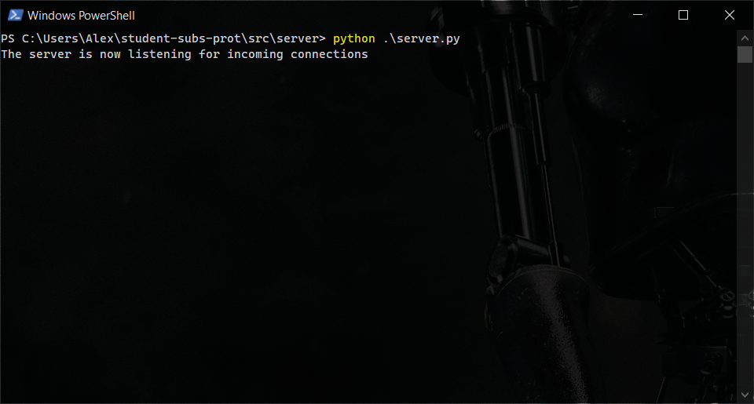
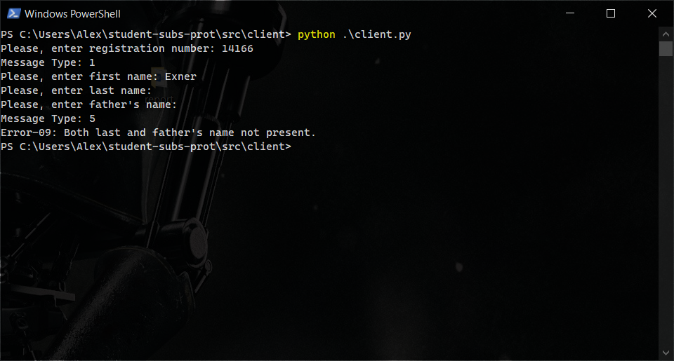

# student-subs-prot 👩🏻‍🎓👨🏾‍🎓

This repository contains a Python implementation of a simple student subscription protocol, based on an internet draft by Professor Evangelos Haleplidis. The project was developed as part of a course on Internet Protocols at the University of Piraeus (UNIPI) in 2023.

## Protocol Overview

The protocol enables students to subscribe to the university database by providing their information in a random order. It follows a client-server model, where the client initiates the communication, and the server requests information from the client.

### Communication Flow

1. **Client Registration Request**: The client sends a registration request, including the student's 5-digit registration number.

2. **Information Requests**: After processing the registration request, the server generates a random sequence of information requests. The server asks for the following information in a random order:

    - Student's Full Name: The client must provide the student's full name, including the first name, last name, and father's name.
    - Student's Phone Number: The client is required to provide a 10-digit phone number.
    - Student's Postal Address: The client is requested to provide the postal address, including the 5-digit postal code, street address, and country.

3. **Error Handling**: If any of the requested information is missing or invalid in the client's reply, the server terminates the connection.

4. **Network Error Simulation**: The protocol simulates network errors with a 35% chance of message rejection. In such cases, the server requests a repeat of the rejected message from the client, which the client promptly fulfills.

## Directory Structure

The source code of the implementation is organized within the `src/` directory, which contains the following subdirectories:

-   `src/client/`: Contains files specific to the client application.

    -   `utils/`: Contains general-purpose files used by the client.
    -   `messages/`: Contains files for constructing messages sent from the client to the server.
    -   `handlers/`: Contains files for handling the messages received by the client from the server.
    -   `client.py`: The main program of the client, utilizing the files from the above directories.

-   `src/server/`: Contains files specific to the server application.
    -   `utils/`: Contains general-purpose files used by the server.
    -   `messages/`: Contains files for constructing messages sent from the server to the client.
    -   `handlers/`: Contains files for handling the messages received by the server from the client.
    -   `server.py`: The main program of the server, utilizing the files from the above directories.

## Getting Started

### Prerequisites

Before getting started, make sure you have Python installed on your machine. If you haven't installed Python, you can download it from the [official Python website](https://www.python.org/downloads/).

### Installation

Follow the steps below to install and set up the project on your local machine:

1. Clone the repository to your local machine using the following command:

    ```bash
    git clone https://github.com/Exner7/student-subs-prot.git
    ```

2. Navigate to the project's root directory:

    ```bash
    cd student-subs-prot
    ```

### Usage

1. **Start the Server:**

    - To run the server application, use the following command:
        ```bash
        python src/server/server.py
        ```
    - The server should start and listen for incoming connections on the IP address localhost (127.0.0.1) and port 54321.

2. **Start the Client:**

    - Open a new terminal or command prompt window (while keeping the server running).
    - To run the client application, use the following command:
        ```bash
        python src/client/client.py
        ```

3. Follow the protocol's communication flow as described in the "Protocol Overview" section to perform student subscriptions securely.

Please note that the server application should be started before running the client application to ensure proper communication.

## Examples

### Early Termination Message

To illustrate the early termination scenario, follow the steps below:

1. Start the server application by running the following command:

    ```
    python src/server/server.py
    ```

    The server should start running and listen for incoming connections.

    

2. Open a new terminal or command prompt window and start the client application by running the following command:

    ```
    python src/client/client.py
    ```

3. Enter the prompted information but leave the "Last Name" and "Father's Name" fields empty by pressing Enter when prompted for their values.

    

    Since the values for the last name and father's name are empty, the server responds with an Error-09, indicating an invalid input. The server terminates the connection while still functioning, as per the protocol specification. Similarly, the server would respond with appropriate termination codes for other errors, such as not passing a phone number.

### Successful Operation

To demonstrate the successful operation of the protocol, follow the steps below:

1. Start the server application by running the following command:

    ```
    python src/server/server.py
    ```

2. Open a new terminal or command prompt window and start the client application by running the following command:

    ```
    python src/client/client.py
    ```

3. Enter the requested information correctly when prompted. Note that the server may request the information in a different order than the previous example.

    

    Once all the information is provided correctly, the server responds with the message "All went well, the connection is to be terminated," indicating a successful operation. The server terminates the connection, as specified in the protocol draft. On the other hand, the server has received and processed the provided information, as shown in the screenshot above.

    
